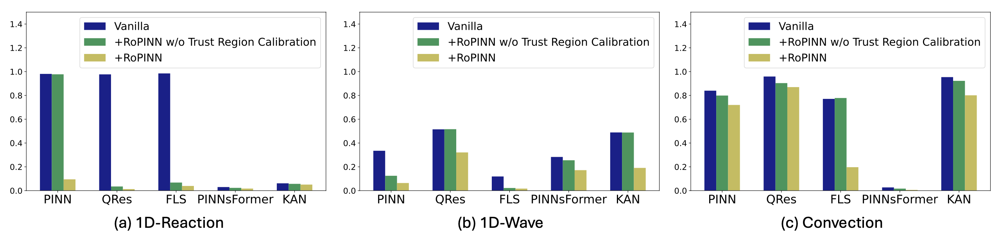

# RoPINN (NeurIPS 2024)

RoPINN: Region Optimized Physics-Informed Neural Networks. See [Paper](https://arxiv.org/abs/2405.14369) or [Slides](https://wuhaixu2016.github.io/pdf/NeurIPS2024_RoPINN.pdf).

This paper proposes and theoretically studies a new training paradigm of PINNs as **region optimization** and presents [RoPINN](https://arxiv.org/abs/2405.14369) as a practical algorithm,  which can bring the following benefits:

- **Better generalization bound:** Introducing "region" can theoretically decrease generalization error and provide a general theoretical framework that first reveals the balance between generalization and optimization.
- **Efficient practical algorithm:** We present RoPINN with a trust region calibration strategy, which can effectively accomplish the region optimization and reduce the gradient estimation error caused by sampling.
- **Boost extensive backbones:** RoPINN consistently improves various PINN backbones (i.e. PINN, KAN and PINNsFormer) on a wide range of PDEs (19 different tasks) without extra gradient calculation.

## Point Optimization vs. Region Optimization

Unlike conventional point optimization, our proposed region optimization extends the optimization process of PINNs from isolated points to their continuous neighborhood region.

<p align="center">

<br><br>
<b>Figure 1.</b> Comparison between previous methods and RoPINN.
</p>

## Practical Algorithm

We present RoPINN for PINN training based on Monte Carlo sampling, which can effectively accomplish the region optimization without extra gradient calculation. A trust region calibration strategy is proposed to reduce the gradient estimation error caused by sampling for more trustworthy optimization.

<p align="center">

<br><br>
<b>Figure 2.</b> RoPINN algorithm.
</p>

## Get Started

1. Install Python 3.8 or Python 3.9 and **Pytorch 1.13.0**. For convenience, execute the following command.

```shell
pip install -r requirements.txt
```

2. Train and evaluate model. We provide the experiment scripts of all benchmarks under the folder `./scripts/`. You can reproduce the experiment results as the following examples:

```shell
bash scripts/1d_reaction_point.sh # canonical point optimization
bash scripts/1d_reaction_region.sh # RoPINN: region optimization
bash scripts/1d_wave_point.sh # canonical point optimization
bash scripts/1d_wave_region.sh # RoPINN: region optimization
bash scripts/convection_point.sh # canonical point optimization
bash scripts/convection_region.sh # RoPINN: region optimization
```

Specifically, we have included the following PINN models in this repo:

- [x] PINN (Journal of Computational Physics 2019) [[Paper]](https://github.com/maziarraissi/PINNs)
- [x] FLS - (IEEE Transactions on Artificial Intelligence 2022) [[Paper]](https://arxiv.org/abs/2109.09338)
- [x] QRes - (SIAM 2021) [[Paper]](https://arxiv.org/abs/2101.08366)
- [x] KAN - (arXiv 2024) [[Paper]](https://arxiv.org/abs/2404.19756)
- [x] PINNsFormer - (ICLR 2024) [[Paper]](https://arxiv.org/abs/2307.11833)

## Results

We have experimented with 19 different PDE tasks. See [our paper](https://arxiv.org/abs/2405.14369) for the full results.

<p align="center">

<br><br>
<b>Figure 3.</b> Part of experimental results of RoPINN.
</p>

## Citation

If you find this repo useful, please cite our paper.

```
@inproceedings{wu2024ropinn,
  title={RoPINN: Region Optimized Physics-Informed Neural Networks},
  author={Haixu Wu and Huakun Luo and Yuezhou Ma and Jianmin Wang and Mingsheng Long},
  booktitle={Advances in Neural Information Processing Systems},
  year={2024}
}
```

## Contact

If you have any questions or want to use the code, please contact [wuhx23@mails.tsinghua.edu.cn](mailto:wuhx23@mails.tsinghua.edu.cn).

## Acknowledgement

We appreciate the following GitHub repos a lot for their valuable code base or datasets:

https://github.com/AdityaLab/pinnsformer

https://github.com/i207M/PINNacle
